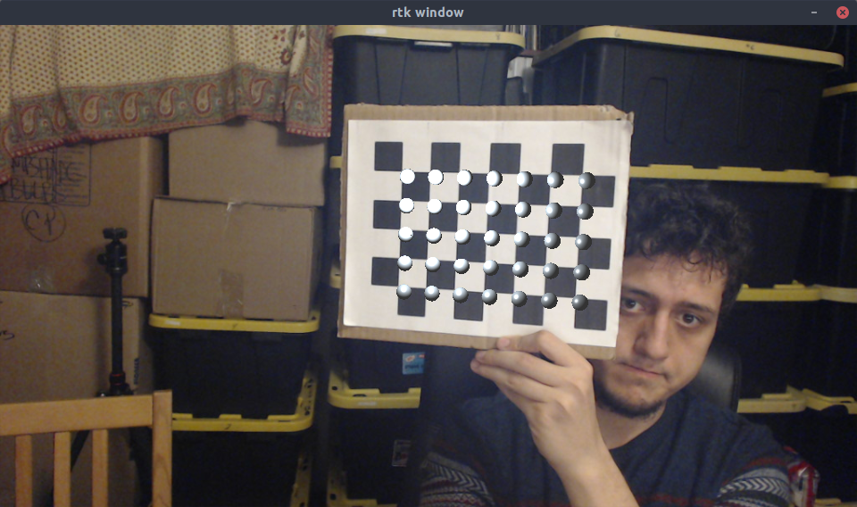

# camera calibration project  
  
This project implements:  
  
+ Camera calibration  
+ Real time pose estimation  
+ 3D rendering on top of a checkerboard pattern  
  
For camera calibration and pose estimation OpenCV is used.  
For 3D rendering, my rendering library was used: [https://github.com/FatihBAKIR/rtk](https://github.com/FatihBAKIR/rtk)  
  
The camera I've used is a Logitech C920 camera with 960x540 resolution. It's calibration result can be found in `c920.yaml`.  

The calibration result for the sample set of images we were given can be found in `video.yaml`.

Spheres on the checkerboard corners: 
Video with a realistic model: [https://youtu.be/T9sQ3iqEtcQ](https://youtu.be/T9sQ3iqEtcQ)  

## Intrinsic Parameter Comparison

My camera has a narrower vertical field of view with 43 degrees where the camera in the sample set has a 51 degrees of vertical FoV. However, my camera has a broader horizontal field of view with 70 degrees compared to 63. I believe this difference is due to the aspect ratios of the cameras. My camera captures a 16x9 image compared to the 4x3 in the samples.

As both cameras have $k_1 > 0$, they have positive barrel distortions. However, the $k_1$s for both cameras are quite small that they are barely visible in pictures. $k_1$ of my camera is larger than the sample camera, thus mine should have a larger distortion.

## Average Error Discussion

For the sample inputs, I've found a sum of squared errors of 1051.
Whereas for my camera, I have a sum of squared errors of 100.

First, the corner points in the input image is found using the `findChessboardCorners` function. Then, after the calibration is done, the expected points (`(0, 0, 0), (1, 0, 0), (2, 0, 0), ..., (N, M, 0)`) are projected to the image using the intrinsic parameters and distortion coefficients.

The error is then calculated by l2-normalization between the actual points from OpenCV and the projected points.

These steps are executed for each input image in the training set and the total squared error is the sum of squares of all the l2-normalization results.

Thus, the error is not truly normalized for the image sizes and the cardinality of the training set. The bigger the images or the larger the training set, the larger the error could become.

However, my training set composed of 14 images compared to 11 images in the sample set. Also, resolution of each of my images is larger than the ones in the sample set as well.

I believe this significant difference can be explained by the quality of the images. My set consists of lossless compressed, higher resolution images compared to the lossy low resolution ones in the sample set. Due to the higher quality training set, OpenCV finds a much more accurate camera matrix for my camera, and thus results in a smaller error.